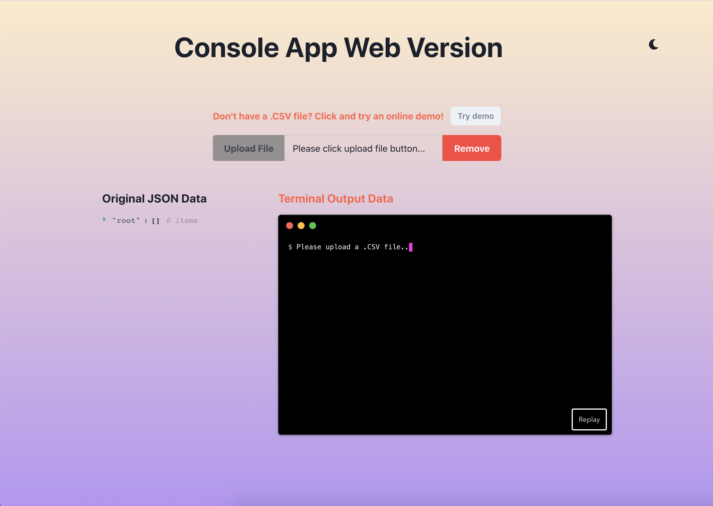

## Console App Web Version

> Here is the console application website version, if you are interested in running on your own machine, please visit this repo...

[Online Demo](https://chenxii.xyz)

### 1. How to run

- Pull this repo to your local machine
- Run `yarn install`
- Run `yarn start`

### 2. Tech Stack

- react(Creact React App)
- chakra-ui
- react-json-view
- react-papaparse
- react-animated-term

### 2. Preview

#### Light Mode

#### Dark Mode

#### Upload CSV File

#### Remove CSV File

#### Table View

